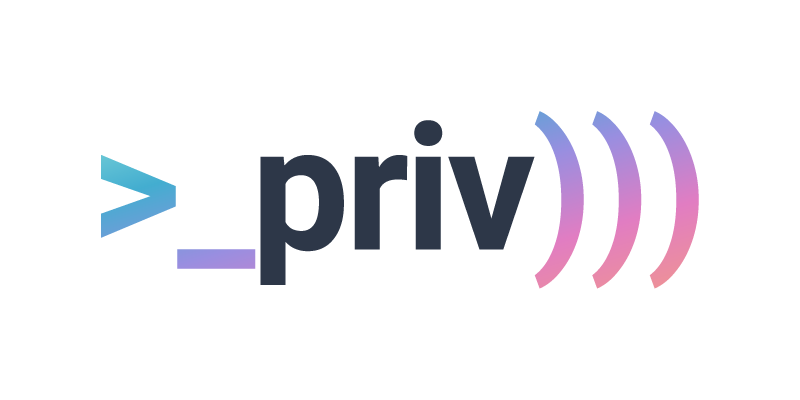

  

# PrivChat

A privacy-focused, cross-platform desktop video chat application. PrivChat ensures your conversations remain private through end-to-end encryption (E2EE) and Peer-to-Peer (P2P) media transport.
This is my personal pet project for learning purposes and a work in progress. Absolutely not ready for production use.

## Key Features

- **🔐 End-to-End Encryption**: Every frame of video and every message is encrypted using standard AES-GCM, with keys derived via X25519 Diffie-Hellman.
- **📡 True P2P Connectivity**: Direct media transport using WebRTC, minimizing latency and ensuring no server ever sees your unencrypted data.
- **🛡️ Anti-Screen Capture**: Native OS-level protections (Windows, macOS) to deter unauthorized recording and screen sharing of your calls.
- **⚡ Lightweight & Secure**: Built on Tauri v2 for a minimal attack surface and high performance.

---

*This project is built for privacy, not profit.*
